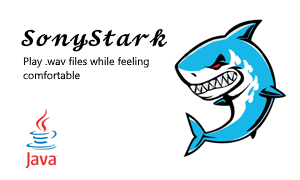
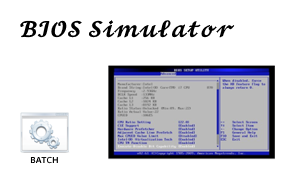

<h3 align="center">Hi there, I'm <a href="https://discord.com/users/1239165757653389324">Ciro</a> 👋</h3>
 
<h1 align="center">I'm a Full-Stack Developer, Gamer 🎮, and Autodidact 🧑‍🏫</h1>

### 🤝 Connect with me

### Projects

  &nbsp;
  &nbsp;
  &nbsp;

## Skills 🛠️🤔

